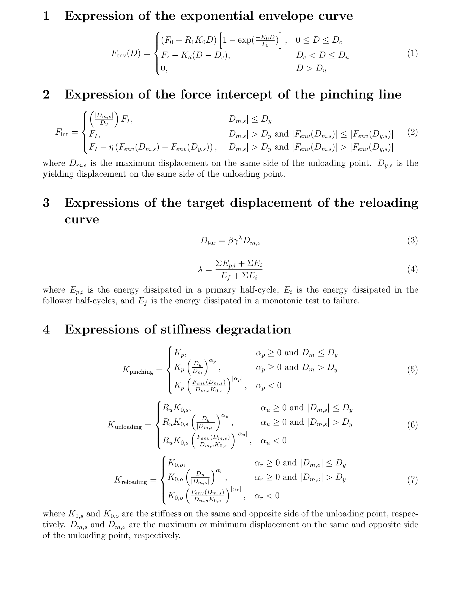

# Dowel Type Timber Joint 

This command is used to construct a uniaxial force-displacement or moment-rotation model which simulates the hysteresis of a dowel-type timber joint, including nails, screws, and bolts, etc. The model has the following features

1. The envelope can be specified with any of the following models: (1) exponential, (2) cubic Bezier, and (3) piece-wise linear, by providing a flag before the defining parameters;
2. The envelopes can be defined either symmetric or asymmetric. Asymmetric envelopes can be defined by providing two sets of envelope parameters. 
3. It is defined by the unloading line, pinching line, and reloading line, connected by Bezier curves to achieve a smooth stiffness transition;
4. It considers the varying of force intercept in the pinching part, defined as a two-segment linear function according to the unloading force;
5. It considers the degradation of unloading stiffness, pinching stiffness, and reloading stiffness, and defines the stiffness as an exponential function of either the maximum displacement to yield displacement ratio, or the secant stiffness to initial stiffness ratio;
6. It considers energy related degradation by using a energy-related damage index to amplify the maximum displacement as the reloading target point. The envelope curve is not changed during loading;
7. It considers the smooth transition of stiffness when the loading path goes from the pinching path directly to the envelope curve.
8. This model can simulate the behavior of joints with asymmetric layout, joints close to edges and restraints, joint groups with steel plates, joints with initial low-stiffness sliding range, etc.


The command to create a DowelType joint model is as follows

---

**(1) Use exponential envelope**

```
uniaxialMaterial DowelType $matTag $Fi $Kp $Ru $c $beta $gamma $eta $Dy $alpha_p $alpha_u $alpha_r -exponential $K0 $R1 $F0 $Dc $Kd <$Du> <$K0N $R1N $F0N $DcN $KdN <$DuN>>
```

**(2) Use Bezier envelope**

```
uniaxialMaterial DowelType $matTag $Fi $Kp $Ru $c $beta $gamma $eta $Dy $alpha_p $alpha_u $alpha_r -bezier $Db1 $Fb1 $Db2 $Fb2 $Dc $Fc <$Du> <$Db1N $Fb1N $Db2N $Fb2N $DcN $FcN <$DuN>>
```

**(3) Use piecewise envelope**

```
uniaxialMaterial DowelType $matTag $Fi $Kp $Ru $c $beta $gamma $eta $Dy $alpha_p $alpha_u $alpha_r -piecewise $D1 $F1 $D2 $F2 $D3 $F3 <$D4 $F4 ...>
```

---

`$matTag` Integer tag identifying the material  

`$Fi` Pinching line force intercept  

`$Ru` Unloading stiffness to initial stiffness ratio  

`$c` Hysteresis curvature factor. Curvature increases when c is larger. (0 <= $c < 2) 

`$beta` An amplification factor of the maximum displacement to account for maximum displacement based strength and reloading stiffness degradation. ( $beta >= 1 )

`$gamma` A factor related to the energy-based damage index, to account for energy based strength and reloading stiffness degradation ( $gamma >= 1 )

`$Dy` Apparent yielding displacement.

`$alpha_p`, `$alpha_u`, `$alpha_r` stiffness degradation factor for pinching line, unloading line, and reloading line, respectively.

`$K0` Initial stiffness

`$R1` Stiffness for the asymptotes of the envelope to initial stiffness ratio.

`$F0` Asymptotes force intercept.

`$Dc` Cap displacement of the envelope.

`$Kd` Absolute descending stiffness.

`<$Du>` Ultimate displacement. By default, the displacement intercept of the descending path is used.

`$Db1`, `$Fb1` The displacement and force of the first controlling point of the Bezier curve.

`$Db2`, `$Fb2` The displacement and force of the second controlling point of the Bezier curve.

`$Fc` Cap force of the envelope.

`$D1`, `$F1`, `$D2`, `$F2`, `$D3`, `$F3`, `<$D4, $F4>` `...` Displacement and force of the piecewise linear envelope curve interpolation points. At least 3 and at most 20 points can be specified. If none of the displacements is negative, a symmetric envelope will be created. Otherwise, asymmetric envelope will be created, by sorting the displacements.


NOTES

1. Terms with a suffix `N` represents the definition for the negative part.
2. See `test` folder for material definition and its corresponding hysteresis.
3. Hysteretic law definition and the equations are shown in the following figures.


